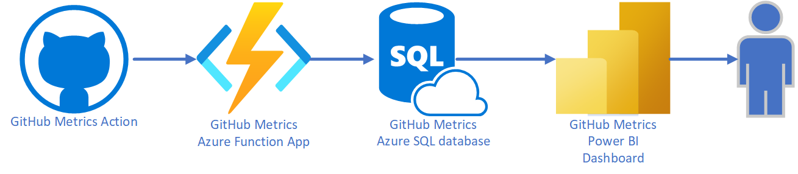
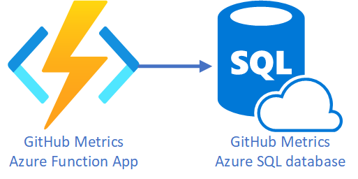
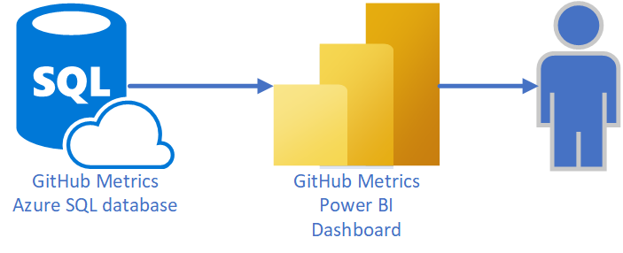

# GitHub Metrics

[GitHub metrics docs](https://gloveboxes.github.io/GitHub-Metrics-Endpoint/)

## Overview



## Set up options

If you are setting up a repo to report to an existing GitHub Metrics application then follow the [Set up a repo to report metrics](#set-up-a-repo-to-report-metrics) instructions.

If you are deploying the GitHub Metrics application then follow the [Deploy the GitHub Metrics solution](#deploy-the-github-metrics-solution) instructions.

## Deploy the GitHub Metrics solution



Follow these steps to deploy the GitHub Metrics solution.

1. Install the following tools:

    1. The [git client](https://git-scm.com/downloads)
    1. The [GitHub CLI](https://github.com/cli/cli#installation)
    1. The [Azure CLI](https://learn.microsoft.com/en-us/cli/azure/install-azure-cli)

1. Open a command prompt.
1. Clone the GitHub metrics solution repository.

    ```bash
    git clone https://github.com/gloveboxes/GitHub-Metrics-Endpoint.git
    ```

1. Change to the `infra` folder in the cloned repository.

    ```bash
    cd GitHub-Metrics-Endpoint/infra
    ```

1. You need to set the Azure location where you want to deploy the solution. The following command lists the available locations.

    ```bash
    az account list-locations --query "[].{Name:name, DisplayName:displayName}" -o table
    ```

1. Run the following command to deploy the GitHub Metrics solution.

    **PowerShell**

    ```powershell
    $env:RESOURCE_GROUP_NAME="<Your_Preferred_Resource_Group_Name>"
    $env:LOCATION_NAME="<Your_Preferred_Location_Name>"
    az group create --name $env:RESOURCE_GROUP_NAME --location $env:LOCATION_NAME
    az deployment group create --resource-group $env:RESOURCE_GROUP_NAME --template-file main.bicep --query properties.outputs
    ```

    **Bash**

    ```bash
    RESOURCE_GROUP_NAME="<Your_Preferred_Resource_Group_Name>"
    LOCATION_NAME="<Your_Preferred_Location_Name>"
    az group create --name $RESOURCE_GROUP_NAME --location $LOCATION_NAME
    az deployment group create --resource-group $RESOURCE_GROUP_NAME --template-file main.bicep --query properties.outputs
    ```

### Azure Function App Endpoint URL

When the deployment completes, the output will display the _reporting_endpoint_url_ and the _reporting_endpoint_key_.

```json
{
  "reporting_endpoint_url": {
    "type": "String",
    "value": "Azure Function App URL: https://function-app-sample.azurewebsites.net"
  },
  "reporting_endpoint_key": {
    "type": "String",
    "value": "Azure Function Host Key: 989asd98a789d7a8d7a98_sample_key"
  }
}
```

1. Update the **github.env** file found in the **config** folder with the _reporting_endpoint_url_ and the _reporting_endpoint_key_.

    ```text
    REPORTING_PAT=
    REPORTING_ENDPOINT_URL=https://function-app-sample.azurewebsites.net
    REPORTING_ENDPOINT_KEY=989asd98a789d7a8d7a98_sample_key
    REPORTING_GROUP=
    ```

1. Save the **github.env** file as you will use this file to upload the GitHub metrics secrets to a repo you want to report to the GitHub Metrics application.
1. Send the **github.env** file to a repo owner so they can upload the GitHub metrics secrets to their repo and start reporting to the GitHub Metrics application.

## Initialize the Azure SQL Database


For now a manual process. This may be automated in the future.

1. Open the Azure Portal
1. Navigate to the Azure SQL Database, by default named `github-metrics`
1. Open the Query Editor
1. Authenticate with the Azure SQL Database using the SQL Admin user and password you used when you deployed the solution.
1. Create the GitHubStats table

    ```sql
    SET ANSI_NULLS ON
    GO

    SET QUOTED_IDENTIFIER ON
    GO

    CREATE TABLE [dbo].[GitHubStats](
        [repo_id] [bigint] NOT NULL,
        [date] [datetime] NOT NULL,
        [id] [int] IDENTITY(1,1) NOT NULL,
        [repo] [nvarchar](256) NOT NULL,
        [group] [nvarchar](64) NOT NULL,
        [clones] [int] NULL,
        [views] [int] NULL,
        [stars] [int] NULL,
        [forks] [int] NULL,
        [active] [bit] NOT NULL,
     CONSTRAINT [PK_GitHubStats] PRIMARY KEY CLUSTERED
    (
        [repo_id] ASC,
        [date] ASC
    )WITH (STATISTICS_NORECOMPUTE = OFF, IGNORE_DUP_KEY = OFF, OPTIMIZE_FOR_SEQUENTIAL_KEY = OFF) ON [PRIMARY]
    ) ON [PRIMARY]
    GO

    ALTER TABLE [dbo].[GitHubStats] ADD  CONSTRAINT [DF_GitHubStats_active]  DEFAULT ('true') FOR [active]
    GO
    ```

1. Create the GitHubStatsDaily view

    ```sql
    SET ANSI_NULLS ON
    GO

    SET QUOTED_IDENTIFIER ON
    GO

    CREATE VIEW [dbo].[GitHubStatsDaily]
    AS

    SELECT TOP(100) PERCENT [group] AS team, repo, clones, [stars], forks, [views], date, EOMONTH(date) AS month_ending, DATEFROMPARTS(YEAR(date),MONTH(date),1)AS [month]
    FROM  dbo.GitHubStats
    WHERE active = 'true'
    GO
    ```

## Set up a repo to report metrics


The instructions below assume you are tracking GitHub metrics for repos in your personal GitHub account. 

To track GitHub metrics for repos in a GitHub organization, then refer to [GitHub organization repos](#github-organization-repos) for information on creating a Personal Access Token for an organization.

### Create a GitHub Personal Access Token

1. Navigate to the GitHub web portal and log in.
1. Select your profile icon in the top right corner.
1. Select **Settings**, then **Developer Settings**, then **Personal Access Tokens**.
1. Select **Fine-grained tokens** and then **Generate new token**.
1. Name the token **GitHub Metrics**.
1. Set the **Expiration**. You probably want to set this to custom and set the date to 1 year in the future.
1. Select **All repositories**, or if you want finer control, select **Only select repositories** and select the repos you want to track.
1. Select **Repository permissions**.
1. Select **Administration** to **Read-only**.
1. Leave the remaining fields with their default values.
1. Select **Generate token**.
1. Copy the token to the clipboard.

### Update the GitHub Secrets environment file

A GitHub secrets environment file simplifies the process of uploading the secrets to one or more GitHub repos.

Use the github.env file you received from the GitHub Metrics solution owner or the one you created in the [Deploy the GitHub Metrics solution](#deploy-the-github-metrics-solution) section.

1. Open the **github.env** file in the `deploy` folder of the cloned repo.
1. Update the **REPORTING_PAT** value with the Personal Access Token you copied to the clipboard in the previous step.
1. Update the **REPORTING_GROUP** field. The group secret is used for consolidated reporting. The group name is arbitrary, for example, use your team name or your GitHub name.
1. The **REPORTING_ENDPOINT_URL** and **REPORTING_ENDPOINT_KEY** values are populated by the GitHub Metrics solution owner.

### Upload the GitHub secrets to your GitHub repos

For each repo you want to track, upload the GitHub secrets by following these steps.

1. Install the [GitHub CLI](https://github.com/cli/cli#installation).
1. Open a command prompt and change to the `deploy` folder of the cloned repo.
1. Authenticate with the GitHub CLI

    ```bash
    gh auth login
    ```

1. Set the GitHub repo secrets by running the following command. Be sure to replace the **\<GITHUB_REPO_URL>** with your target GitHub repo URL.

    ```bash
    gh secret set --env-file github.env --repo <GITHUB_REPO_URL>
    ```

### Add the GitHub Metrics Action to a GitHub repo

```yml
# GitHub Action to post GitHub metrics to an Azure Function App webhook
# Required secrets
#   1. A PAT with repo rights:    PAT_REPO_REPORT
#   2. The webhook endpoint url:  REPORTING_ENDPOINT_URL
#   3. The webhook endpoint key:  REPORTING_ENDPOINT_KEY
#   4. Reporting group/team:      REPORTING_GROUP

name: "GitHub repo metrics report"

on:
  schedule:
    # Run this once per day, towards the end of the day for keeping the most
    # recent data point most meaningful (hours are interpreted in UTC).
    - cron: "0 23 * * *"
  workflow_dispatch: # Allow for running this manually.

jobs:
  report_metrics_job:
    runs-on: ubuntu-latest
    name: GitHub repo metrics report
    steps:
      - name: run github metrics image
        id: github_metrics
        uses: gloveboxes/GitHubMetricsAction@v1
        with:
          github_repo: ${{ github.repository }}
          github_personal_access_token: ${{ secrets.REPORTING_PAT }}
          reporting_endpoint_url: ${{ secrets.REPORTING_ENDPOINT_URL }}
          reporting_endpoint_key: ${{ secrets.REPORTING_ENDPOINT_KEY }}
          reporting_group: $${{ secrets.REPORTING_GROUP }}
```

## Power BI Report



## Contributing

This project is open source and welcomes contributions. Please raise an issue or submit a pull request.

## Appendix

### GitHub organization repos

#### Create a GitHub Organization Personal Access Token

1. Navigate to the GitHub web portal and login.
1. Select your profile icon in the top right corner.
1. Select **Settings**, then **Developer Settings**, then **Personal Access Tokens**.
1. Select **Fine-grained tokens** and then **Generate new token**.
1. Name the token **GitHub Metrics ORGANIZATION_NAME** and add the name of the GitHub organization you want to track.
1. Set the **Expiration**. You probably want to set this to custom and set the date to 1 year in the future.
1. Select the **Organization** you want to track from the **Resource owner** dropdown list.
1. Select **All repositories**, or if you want finer control, select ***Only select repositories*** and select the repos you want to track.
1. Select **Repository permissions**.
1. Select **Administration** to **Read-only**.
1. Leave the remain fields with their default values.
1. Select **Generate token**.
1. Copy the token to the clipboard.